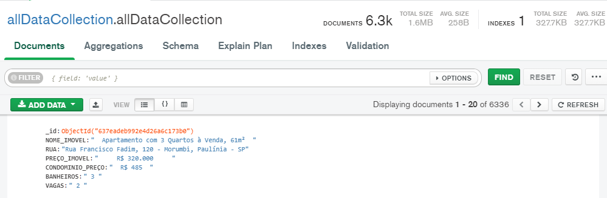

(Integrantes: Matheus Henry Barbosa, Thiago Rossi Lazarin, Matheus Das Neves Camargo)

First steps

1 - pip install scrapy

2- Instalar os pacotes de python

3 -  Passo executar o arquivo imoveis.py com o seguinte comando -> (scrapy runspider imoveis.py)
esse comando vai guardar todos apartamentos de um determinado site no json e no banco de dados de apartamentos.

4 -  Passo executar o arquivo imoveis.py com o seguinte comando -> (scrapy runspider emcasa.py)
esse comando vai guardar todos apartamentos de um determinado site no json e no banco de dados de casa.

5  -  Passo executar o arquivo imoveis.py com o seguinte comando -> (scrapy runspider daltonGoncales.py)
esse comando vai guardar todos imoveis de um determinado site no json e no banco de dados do Dalton.

6 - Executar o arquivo fullDataCapture onde armazenar todos imoveis capturados em uma unica coleção

